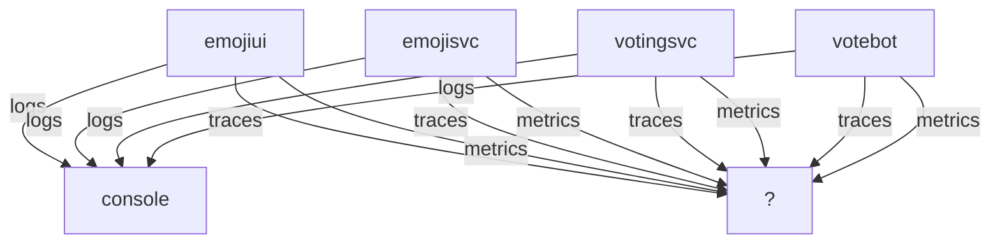
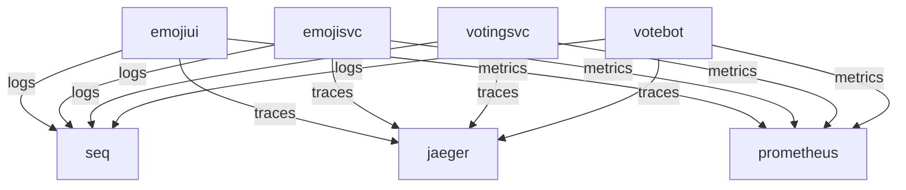
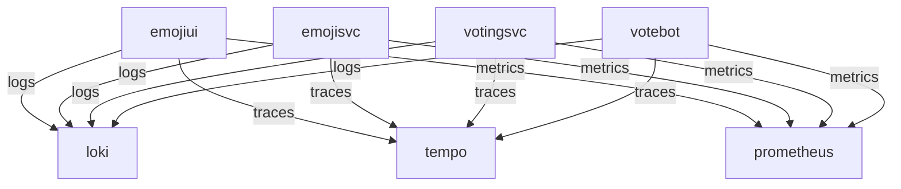
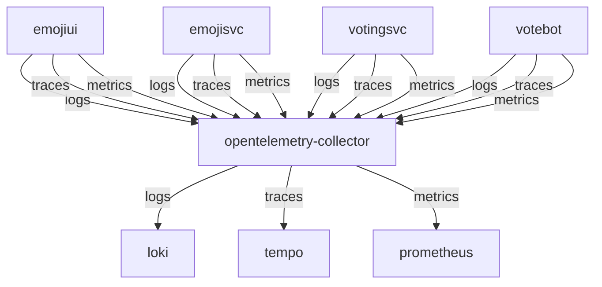
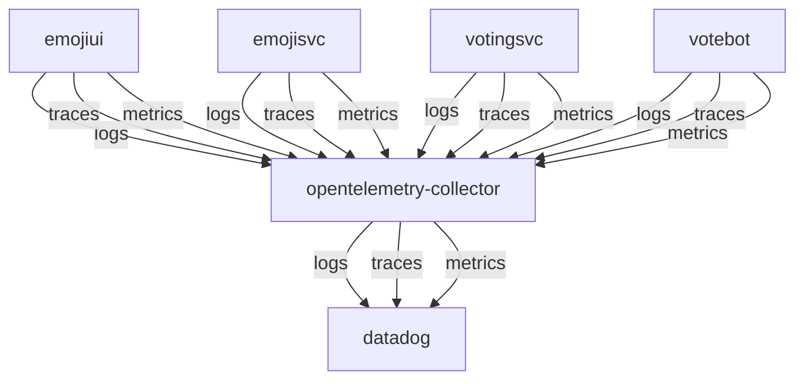

# emojivoto-dotnet

## Description

This repository contains a `.NET Core` ported version of the [EmojiVoto](https://github.com/BuoyantIO/emojivoto) project, which is written in Go. It also showcases `Opentelemetry`'s benefits through multiple scenarios using `docker-compose` and `kubernetes`.

## Setup (Docker)

### Enable metrics from docker engine

Reference: [https://docs.docker.com/config/daemon/prometheus/#configure-docker](https://docs.docker.com/config/daemon/prometheus/#configure-docker)

To configure the Docker daemon as a Prometheus target, you need to specify the metrics-address. The best way to do this is via the daemon.json, which is located at one of the following locations by default. If the file does not exist, create it.

* Linux: /etc/docker/daemon.json
* Windows Server: C:\ProgramData\docker\config\daemon.json
* Docker Desktop for Mac / Docker Desktop for Windows: Click the Docker icon in the toolbar, select Preferences, then select Daemon. Click Advanced.
If the file is currently empty, paste the following:

```json
{
  "metrics-addr" : "127.0.0.1:9323",
  "experimental" : true
}
```

If the file is not empty, add those two keys, making sure that the resulting file is valid JSON. Be careful that every line ends with a comma (,) except for the last line.

Save the file, or in the case of Docker Desktop for Mac or Docker Desktop for Windows, save the configuration. Restart Docker.

Docker now exposes Prometheus-compatible metrics on port 9323.

### Build docker images

Optionally we want set the version derived from the current branch

```powershell
choco install gitversion # as admin
$env:SemVer = (gitversion | ConvertFrom-Json).SemVer
```

```powershell
docker-compose --profile app build
```

## Different monitoring scenarios

### No monitoring, just console logging

Without passing extra parameters/environment vars, this setup does only basic console logging.
The profile `app` is passed to only deploy the services of the app itself.

```powershell
docker-compose --profile app up -d --remove-orphans
```

With this setup we have an application that is up and running at [localhost:8080](http://localhost:8080),
but without any means of observability, except that console output.



To bring the app back down

```powershell
docker-compose down
```

### Monitoring to individual services (jaeger, seq, prometheus)

Providing extra environment variables through `docker-compose.individual.yaml`, the app can be reconfigured to start outputting to the individual services `seq`, `jaeger` and `prometheus`.



```powershell
docker-compose --profile app --profile individual -f docker-compose.yml -f docker-compose.individual.yaml up -d --remove-orphans
```

Each component is reconfigured to output to each monitoring service. That means each service now outputs:

* metrics on an endpoint which is then scraped by `prometheus`
* traces to `jaeger`
* logs directly to `seq`

Although we have some observability now, we still need to reconfigure each service.

### Monitoring to individual services (loki, tempo, prometheus)

We could also reconfigure to output to other services like `loki`, `tempo` and `prometheus`, but we need to do that by adjusting each component individually.



```powershell
docker-compose --profile app --profile grafana -f docker-compose.yml -f docker-compose.individual-grafana.yaml up -d --remove-orphans
```

Each component is reconfigured to output to each monitoring service. That means each service outputs:

* metrics on an endpoint which is scraped by `prometheus`
* traces to `tempo`
* logs directly to `loki`

Downside is still that we heave to reconfigure each service to get monitoring up and running.

### Monitoring through opentelemetry (grafana backend)



We let the app output to just one component: `opentelemetry-collector`. From there we then can decide where each output should go without
having to reconfigure it in the application itself. Instead of configuring three endpoints, we just have to deal with one.

Reconfiguring to output to opentelemetry

```powershell
docker-compose --profile app --profile otlp -f docker-compose.yml -f docker-compose.otlp.yaml up -d --remove-orphans
```

### Monitoring through opentelemetry (datadog)

Now instead having to run that monitoring backend outselves, we can also choose to output to a cloud service like [Datadog](https://datadoghq.com) or [Splunk](https://www.splunk.com/). This example shows exporting to Datadog.

> Make sure you create an `.env` file with your `DD_API_KEY` and `DD_SITE` values.



```powershell
docker-compose --profile app --profile datadog -f docker-compose.yml -f docker-compose.otlp-datadog.yaml up -d --remove-orphans
```
